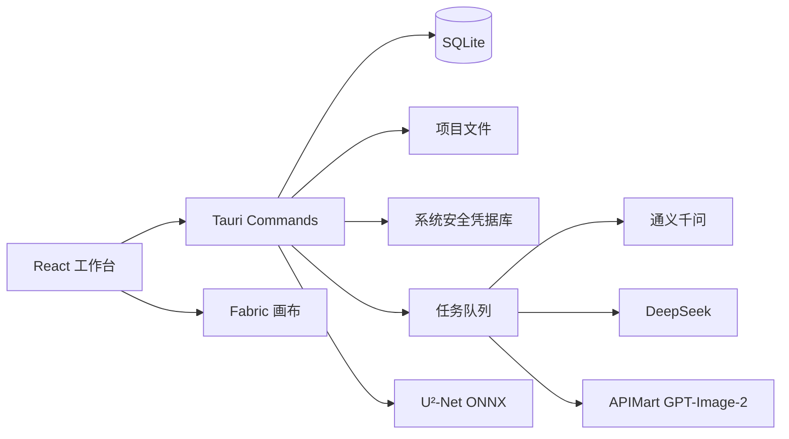

# 总体架构

## 技术栈

- 桌面容器：Tauri 2。
- 界面：React、TypeScript、Vite、Fabric.js。
- 本地核心：Rust。
- 数据：SQLite + 项目资产目录。
- 安全密钥：Windows Credential Manager / macOS Keychain。
- 本地抠图：U²-Net ONNX，最终模型文件需记录来源、哈希和许可证。

## 模块

## 设计原则

- 前端不直接持有完整密钥；调用经 Rust 命令完成。
- API 客户端、轮询器和导出器可单元测试，界面只消费类型化结果。
- 任务先写数据库再执行，状态更新采用幂等写入。
- 供应商响应先标准化，再进入业务状态和画布。
- 项目路径必须规范化并限制在用户明确选择的目录。

## 进程边界

React 负责即时 UI 状态和画布交互；Rust 负责密钥、网络、SQLite、文件读写、归档和计算密集型工作。长任务使用异步命令和事件，不占用主线程。

