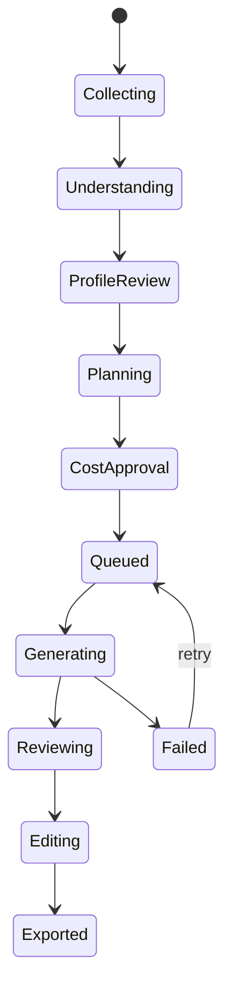

# 模型分工与 Agent 流程

## 固定分工

- 通义千问 `qwen3.6-flash`：读取产品图片，输出商品档案、可见文字、材质、结构和风险提示。
- DeepSeek `deepseek-v4-flash`：把档案、平台预设和用户意图转换为生成计划、提示词、工具调用与质量修复建议。
- APIMart `gpt-image-2`：执行生成、参考图生成和局部图片修改。

## Agent 状态机

## 工具边界

Agent 可以读取项目档案、平台预设和选中素材，创建/修改生成计划，轮询状态并提出修复建议。Agent 不得替用户提交付费生成，不得删除原素材、导出覆盖文件或把密钥加入提示词。

## 两种用户模式

- `advisor / 方案顾问`：只读分析与方案建议，不产生本地修改动作。
- `operator / 操作助手`：DeepSeek 只返回受限 JSON 操作计划。前端先展示步骤，用户点击“确认并执行”后才派发本地事件；允许动作限于平台、类目、生成需求、图片类型与候选数。
- 两种模式在界面上分别解释用途。会话按项目隔离写入 SQLite，支持新建、历史、清空确认、流式输出、停止、重试、步骤和错误状态。

## 结构化输出

所有跨模型数据用版本化 JSON Schema 校验。无法解析时最多进行一次修复调用；仍失败则保留原响应摘要并要求用户重试。
