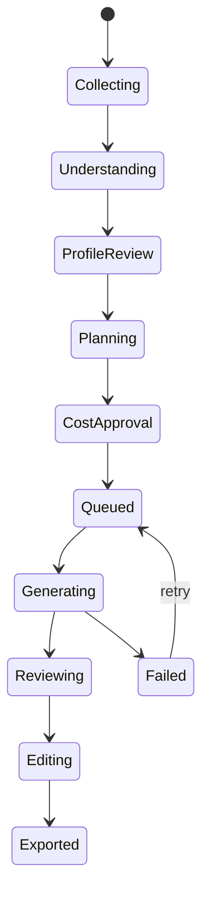

# 模型分工与 Agent 流程

## 固定分工

- 通义千问 `qwen3.6-flash`：读取产品图片，输出商品档案、可见文字、材质、结构和风险提示。
- DeepSeek `deepseek-v4-flash`：把档案、平台预设和用户意图转换为生成计划、提示词、工具调用与质量修复建议。
- APIMart `gpt-image-2`：执行生成、参考图生成和局部图片修改。

## Agent 状态机

## 工具边界

Agent 可以读取项目档案、平台预设和选中素材，创建/修改生成计划，轮询状态并提出修复建议。Agent 不得替用户提交付费生成，不得删除原素材、导出覆盖文件或把密钥加入提示词。

## 两种用户模式

- `advisor / 方案顾问`：只读分析与方案建议，不产生本地修改动作。
- `operator / 操作助手`：DeepSeek 只返回受限 JSON 操作计划。前端先展示步骤，用户点击“确认并执行”后才派发本地事件；允许动作限于平台、类目、生成需求、图片类型与候选数。
- 两种模式在界面上分别解释用途。会话按项目隔离写入 SQLite，支持新建、历史、清空确认、流式输出、停止、重试、步骤和错误状态。

## 结构化输出

所有跨模型数据用版本化 JSON Schema 校验。无法解析时最多进行一次修复调用；仍失败则保留原响应摘要并要求用户重试。

## 商品档案缓存

- qwen 视觉分析产物按项目落库 `product_profiles`（profile_json / source_path / updated_at，迁移 v6 加 source_path 列）。
- 同一主图（source_path 相同）跨批次、跨会话复用缓存，不重复调用 qwen；主图更换才重新分析。
- 档案由生成规划（`generationPipeline`）与方案顾问（`AgentPanel`）共用；分析指令 `PRODUCT_PROFILE_SYSTEM` 单源（`src/lib/generationPipeline.ts`），避免两份字符串漂移。
- 顾问提示词强制引用档案具体数据（颜色/结构/商标/材质/风险），建议格式 `[类型名·平台名] 建议：…`。

## 操作助手动作校验

操作助手输出 JSON 动作计划（`summary` + `actions[]`）。前端逐动作校验：平台/类目必须命中注入的枚举（中文全称），类型动作的 `typeId` 必须存在，越权动作标红不执行；确认执行后反馈「执行 n 个，拒绝 m 个（原因）」。允许动作：`set_platform` / `set_category` / `set_brief` / `set_generation_type` / `navigate`，枚举单源 `src/lib/agentSchema.ts`。动作计划无法解析或全部非法时，携带原因提示进行一次修复调用。
